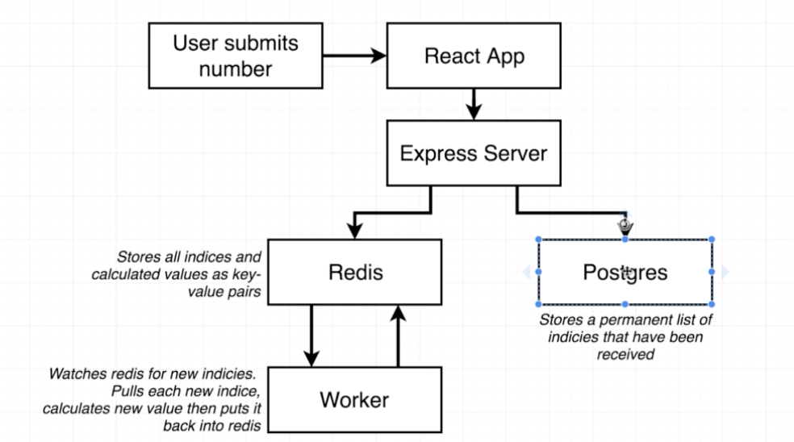
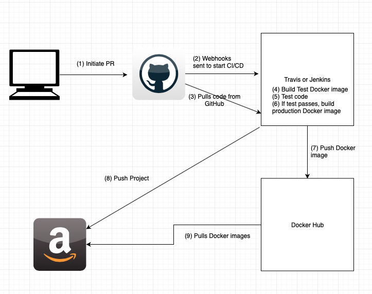

# CICD example

- Frontend - React
- DB - Postgres
- Redis
- Express for Routing

- Following is brief server/frontend data flow.
- Creating four containers.  
  (1) client container - React app
  (2) server container - Express server, Postgres DB, Redis Server
  (3) Worker container - Redis client
  (4) Nginx container - Web/Backend Router

  

* The goal of this repo is to achieve complete CI/CD with Travis/DockerHub/AWS EB.  
  Note: This is repo completed upto DockerHub (in the following diagaram, upto Step (7)). The next step is to deploy Docker images to AWS EB.  
   
